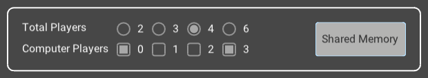

# Haskell Chinese Checkers Platform

> A platform of Chinese Checkers game with multiple players allowed as well as embedded Monte-Carlo Tree Search algorithm.

This markdown sheet is an user guide for those who want to access to the platform, the remainder will be divided into three parts: installation and the first launch of the executable, the experimental section, as well as some detailed look at the framework design, including the GUI section and the code implementation. 

<div align="center">
    
</div>


All the sample files provided in this repository are generated based on stack and cabal environment of macOS, therefore, if you are a user of a different computer system, you may want to build up the corresponding environment first such that application could be generated and run. 

Please make sure that you've already installed sufficient Haskell environments: 

* GHC (8.10.7)
* Cabal (3.6.2.0)
* Stack (2.9.3)

If not, then you might want to have a look at how to [install](https://www.haskell.org/ghcup/) them easily through **GHCup**. Besides, it is also required for the user to install certain libraries to ensure the executable file provided can run correctly, which will also be mentioned in the coming sections. 

The following instructions will be descirbed based on macOS environment by default, but will also provide some information of other platforms. 


### Monomer starter application

Before we moving on, it is significant to let you know that the GUI part of this platform makes use of a Haskell graphical library called "Monomer". More specifically, the interface is structured based on the given sample script of starter application, including:

- Dependencies
- Model and events type
- Event handler
- UI builder

For more information, please check [here](https://github.com/fjvallarino/monomer) and [here](https://github.com/fjvallarino/monomer-starter).


## Installation

To install the application, the folder needs to be cloned from the repository or downloaded from the zip file from the submission.

```bash
git clone git@projects.cs.nott.ac.uk:scyty3/msc-project.git <your-app-name>
```

After you clone the project or extract the file, open the terminal, either bash or zsh, and navigate to the folder "second-semester":

```bash
cd ./msc-project/second-semester/
```

Then you will see an executable named `app` through browsing the files in the folder. The executable `app` was copyed manually from the default generation address of stack and can be launched through the below command:

```bash
./app
```

To be noticed that before launching the exectable, you must install additional packages so that the GUI can be run. Please look at the [installation](https://github.com/fjvallarino/monomer/blob/main/docs/tutorials/00-setup.md) for those required packages. 

For Mac users, the following commands are required to install the `sdl2` and `glew`. 

```bash
brew install sdl2
brew install glew
```

Such installation is done through [Homebrew](https://brew.sh), in case you haven't installed it, it is a popular package manager for macOS and Linux. In order to install Homebrew, you may need to enter following command:

```bash
/bin/bash -c "$(curl -fsSL https://raw.githubusercontent.com/Homebrew/install/HEAD/install.sh)"
```

Besides, after the Homebrew is successfully installed, package `pkg-config` is necessary to be installed next:

```bash
brew install pkg-config
```

After all these done, you can now try to install packages `sdl2` and `glew` through the above given commands. And then, the executable file should be able to run directly on Mac. 

Moreover, if you're interested in how to set up the environment (stack and cabal), you can have a look at the next two sections, where the instructions are provided for maintaining such an environment allowing user to make change on the code. Otherwise, you can skip to the next part that teaches the user how to make use of the platform visually.  


### Stack Environment

Since the application introduces a third-party library for displaying the graphical interface, if you want to make a change to the `Main.hs` and test it, you will need to set up a stack environment.

To build up the environment, navigate to the folder called "second-semester" and run the `stack build` command.

```bash
cd ./msc-project/second-semester/
stack build
```

This command will construct the necessary libraries based on the specifications from `package.yaml` and set up an environment under this folder, mainly for setting the dependencies for the Monomer libaray. 

Here is the link to the detailed [installation](https://github.com/fjvallarino/monomer/blob/main/docs/tutorials/00-setup.md), also includes other platforms' instructions, in case you'd like to set up such an environment yourself. 

Notice that, you might be required to install additional packages based on your operating system as mentioned above, so please have a look at the provided link. In order to load all necessary libaraies, it might take around 10 minutes to fully install all libraries and packages after the `stack build` command. You will be able to see the number of downloaded packages and their progresses.   

If no error appears, you can then run `stack run Main`, then the application should be successfully executed. Initially, it's the same as the given `app` executable, but can be recompiled if you modify the code later on.

Run the `stack build` command every time you make a change to the code, and the program will recompile and generate a new executable based on that. After that, run `stack run Main`, and the new executable will be run. 

Normally, a path to the produced executable would be provided in the hidden folder ".stack-work". Depending on your operating system, the full path should be something like `.stack-work/install/.../bin/app`.	


### Cabal Environment

If you are not satisfied with accessing just the graphical interface section `Main.hs` and want to access other component scripts such as the `GameTree.hs`, `MCTS.hs`, `Minimax.hs` that deal with the algorithm part. Or you might want to execute specific function of a script individually by `ghci`, you then will need to install all the imported packages applied in this project. 

The following are the imported packages applied in the project other than the `Main.hs`:

* `random`
* `mtl`
* `extra`
* `parallel`
* `containers`
* `time`
* `async`

They could be set up through the command `cabal install`, for instance, to add the package `random`, first navigate to the `src` folder under the `second-semester`, then run the `install` command:

```bash
cd ./msc-project/second-semester/src
cabal install random
```

Once you have set up all the packages listed above, you can access any `.hs` script in the `src` folder except for `Main.hs` which is mainly run on the evnironment built by the `stack`. For instance, you can now access to the `MCTS.hs` and play arround to the funtions included:

```bash
ghci MCTS.hs
```


### Directory

Before we go further, here the significant contents of the folder `second-semester` will be described to you such that you could understand their functionalities and what their are used for.

The following tree structure demonstrates the files that are worth mentioning to the user. 

 ```bash
 second-semester
     ├── app
     ├── dataset
         └── lookup_table.txt
     ├── src
         ├── BFS.hs
         ├── Board.hs
         ├── Configuration.hs
         ├── Experiment.hs
         ├── Extension.hs
         ├── GameTree.hs
         ├── MCTS.hs
         ├── Main.hs
         ├── Minimax.hs
         ├── RBTree.hs
         ├── Zobrist.hs
         ├── experiments0
         ├── experiments1
         └── experiments2
 ```

First of all, the `app` executable, the one that starts the application. The following `dataset` folder stores the lookup table used in this project, which is a txt file that contains a number of board configurations and the corresponding scores and both of them require specific function to unscramble, which leads to the Haskell scripts in the folder of `src`.

In the `src` folder, there are a list of `.hs` scripts as well as some folders stroing the experiment results. The folders: `experiments` with suffix from $0$ to $2$ contain several lists of winners collected from the experimental tirals generated from the `Experiment.hs`. In `Main.hs`, as mentioned, it contains the components for rendering the graphical interface, and the specific components will be decirbed in the coming section. The `BFS.hs`,  `Configuration.hs` scripts calculate the the entities' contents of the lookup table, the one stored in `dataset` folder, and `RBTree.hs` and `Configuration.hs` together constructre the container's shape and store it in the memory when the program is running. Script `Board.hs` and `Zobrist.hs `define how the board of Chinese Checkers is computed, either in explicit or implicit way. Finally, for processing the MCTS framework, the `GameTree.hs`, `MCTS.hs` and `Minimax.hs` scripts are taken place to give a form of searching appropriate move based on the given board state. 


## Launch the application

Once you enter the application, you will see a menu page listing all options of available players allowed in the game. There are two panels displayed on the screen: one for MCTS configurations and another one for setting the players (human and computer) number. 

<div align="center">
    
</div>


### Menu Page

<div align="center">
    
</div>


In the first panel, the user could set the configurations of the MCTS framework including 

* the parameters of the selection phase's policy
* the choice and the detailed settings of the playout phase's evaluator
* the terminate condition of the MCTS

Other than that, for each computer player, there is an identical panel for setting the corresponding configurations. In order to switch the panel that assoicated to a player, the below `Last` and `Next` buttons will help to index to the right panel. 

To be noticed that, ony the panel corresponds to a computer player could be manipulated, for instance, according to the above sample, only the panels with indices $0$ and $3$ could be adjust with the widgets, and the other panels will not allow the user to modify unless such a computer player is enabled through the below checkboxes.

On the first panel, there are a number for widgets, for which corresponds to a feature of the search algorithm:

* Exploration factor $C$: this controls the *UCT* policy of the MCTS selection phase, that the larger the value is chosen, the more exploration of unvisited nodes (expanded branches of the search tree) will be investigated, otherwise, the decision will tend toward the exploitation of the well-performed nodes more
* History factor $W$: this controls the *Progressive History* policy of the MCTS selection phase, that the larger the value is chosen, the longer the influence on the past game history will be made on the decision
* Simulation evaluator: this controls the mechanism that used to choose the appropriate move throughout the self-play simulation during the MCTS playout phase, you can seen this as a strategy for emulating a game
  * Random choice: uniformly choosing the moves avaliable but with some priorities for the advancing moves.
  * Move distance: picking up the move that gives the lagest distance increment, and if there exist multiple moves with maximum distance increments, then randomly choose one of them.
  * Lookup table: deciding the optimal move based on the stored board values of the resulting board states, such a board value can be found in the lookup table but does not include the fraction of midgame states, hence, as an alternative, the evaluation of the midgame boards is done based on the distance increment. Similarly, the ones with the largest value are decided randomly with uniform possibility. 
  * Midgame-only Paranoid/BRS: here, the moves during the playout phase are no longer simply decided based on certain heuristic or dataset but on an embedded multi-player version of minimax search. Besides, there are two more options to adjust the settings of such an embedded search: first, the search depth from $2$ to $4$; second, the percentage value for calling the embedded search, which allows the user to modify the frequency of triggering the minimax search per move during the playout since it could bring heavier overhead.
* MCTS control: the basic workflow of MCTS consists of: selection, expansion, playout and backpropagation, and a full run through of the four phases is called an interation. The progress of the search could be defined in two ways, first the number of iterations being completed, and second, the time that retricts certain number of iterations from completing. Both restrcitions own the same range from $1$ to $100$, either in rounds or seconds. 

<div align="center">
    
</div>


In the second panel, the first row of radios displays the option of total players of a range of $[2, 3, 4, 6]$ and the second row displays the available computer players, which are strictly restricted to less than the total number of players. In order to the tigger a computer player among all avaliable players, ticking the checkboxes below will turn the player with assoicated index into computer player such that the user could manipulate its configuration panel. 

Besides, there provides an additional feature called `Shared Memory`, which makes difference on the game history. As mentioned before, the choice of MCTS algorithm could be affected based on the game history ($W$), but normally the players will only be affected by the history maintained by themselves. But here, the `Shared Memory` allows all the maintained history to be integrated into one public record such that allowing all players to access to this and contribute their update to it. 

### Game Page

After the players are settled, pressing the `Start Game` button will enter the game, a corresponding board will be generated. For different players, there are ways to distinguish between them. Each player's pieces are numbered with the same index and in the same colour. For instance, in a two-player game, the players will be indexed with ids: $0$ and $1$ and with colours of green and red; in a three-player game, the players will be indexed with ids: $0$, $1$ and $2$ with colours of green, red and orange; and so on.

<div align="center">
    
    
  	<br>
    
    
</div>


To simplify the game, there will be a hint text shown above to remind the player of the certain index to action as well as the winner of the game. Besides, if the user allows computer players to be involved, the hint text will explicitly show which player is AI.

<div align="center">
    
</div>

To move during the game, a player needs to first click one's piece and then click a free space as the destination of the movement. 
<div align="center">
    
</div>

Once the player first clicks a valid position, the resulting available list of destinations will be marked in the corresponding colour as shown above. If an entering movement is invalid, then there will be an error message posted, and the player will need to re-enter another movement. The invalid situations include (1) double-clicking a position, (2) taking a free space at the start of the movement, (3) trying to reach a destination that is too far, or (4) the destination is already occupied by another player. 

<div align="center">
    
    
  	<br>
    
    
</div>

Once the game is finished, the user can close the game or continue the next one with a different setting. Press the `End Game` button, and the page will be returned to the menu, where the user could make a different configuration. 

<div align="center">
    
</div>

In addition, there exist a thread handler for managing the threads being expanded during the game. Since the computer players are allowed to compete with the other players, the equipped search algorithm was designed to be triggered on an individually thread called `Task` in Monomer, therefore, the cash of the IO action won't affect the main thread's application. Considering that the user might terminate the game while the search algorithm is still figuring out which move should be taken, it's significant to kill that activated thread such that the program won't being stalling due to many working threads. 

```bash
Error processing Widget task result: thread killed
```

If such a situation happens, the above error message will be appeared showing that there is a thread being terminated while it is working. 

Meanwhile, there is also a final clean when the close icon is clicked by the user when wanting to leave the application, the following message will be posted to tell the user if all generated threads are cleaned.

```bash
All remaining threads were cleaned
```

Otherwise, it will say:

```bash
Unable to clean all generated threads
```

Which could be due to too many times on restarting a game or some exceptions was occurred. 


## Launch the (experimental) executables

> You can skip this if you are not interested in the experiment sets for this prototype.

Besides the "app", there is also a folder "first-semester/src/executables" containing other executable files:

* buildTree
* experiment0
* experiment1
* experiment1_2
* experiment2

These files can be run in the same way as "app" but might require additional arguments while Windows users would need to set up the cabal environment to run these.  

To generate the executable that fits your operating system, please ensure that you have set up the Cabal environment. 

### buildTree

> This executable can be generated from script Configuration.hs

This executable is used for generating the entities for the lookup table. Since there are total $27,228$ entities, it's not possible to finish all computations in a short time, therefore, the executable allows the user to split the entities into several subsections and compute them in parallel.

Run the executable, which requires 3 arguments:

* how many subsections do you want to split into: $n$
* the index of the generated subsection: $[0, n-1]$
* the width used for the heuristic algorithm: $(w_1,w_2)$

For instance,

```bash
./buildTree 16 0 (800,200)
```

The above command declares that the total entities of $27,228$ are roughly divided into $16$ groups: $[s_0, s_1, ...s_{15}]$, and the computation will be made on the first group ($s_0$). $(800,200)$ are the parameters used by the shortest path search algorithm that processes a breadth-first search to find the minimum moves of a board configuration to reach the win state, $800$ is the generation size for searching the opening of the game while $200$ is for the ending.   

Normally, this will take a lot of time to compute all $16$ subsections, even though several programs can be run separately at the same time. The collected data will be stored in a txt file "first-semester/src/dataset/lookup_table_0.txt" based on the given index, in this case, it is $0$. 

Besides, a complete txt file with all entities is provided in the folder "first-semester/src/dataset". 

To compile the executable file, run the below command under folder "first-semester/src", might need to uncomment the "main" function in advance.

```bash
ghc -main-is Configuration Configuration.hs -O2 -outputdir dist -o executables/buildTree
```

After that, you will get the desired executable in the file called "executables".

### experiment0

> The following executables can be generated from script Experiment.hs, to compile the executable, you might need to uncomment the corresponding "main" function

"experiment0", as its name, is not exactly counted as an experiment, it is just a simple test for the MCTS algorithm to reflect its effectiveness. The MCTS applied is constrained by how many iterations it can process, and in this experiment, the user can control the number of iterations $N$ and the constant for the selection strategy $(C, W)$. 

For instance, 

```bash
./experiment0 500 (3,5)
```

The above command will assign $500$ iterations to the search and a pair of parameters $(3,5)$ to the formula used for defining the optimal choice. The experiment will run four trials with players in the range of $[2, 3, 4, 6]$, and stores the turns played by the game simulations in a txt file "first-semester/src/experiment0/experiment.txt". 

### experiment1 & experiment1_2

The experiment is divided into two parts here, it runs based on a similar pattern as the previous one but rather than just a single trial, it allows the user to define how many trials a certain parameter pair should run with default iterations. The experiment tests the performance of the algorithm by trying different combinations of parameters, $C$ and $W$, while the first part only tests the integer combination and the second allows double values. 

For the first part of the experiment, the range is set from 0 to 5 for both parameters, such that there is a total of $36$ pairs of integral values. On the other hand, the second section provides 10 pairs that given a known $C$ combining it with a list of $Ws$: $[0.1, 0.2, ...1.0]$ .

For instance, the below commands run the simulations on a three-player board. 

```bash
./experiment1 3 500
./experiment1_2 3 4 500
```

For "experiment1", for every $36$ parameter pairs, there are 500 trials to run with. For "experiment1_2", given a known $C=4$, such that there are a total of $40$ combination, and for each combination, there are 500 trials to run with. The collected data is the convergence of the search, that is, how fast it eventually turns to find the most "promising path" of the game and will be stored in "first-semester/src/experiment1/experiment_3.txt" and "first-semester/src/experiment1/experiment_3_4.txt" based on the examples. 

### experiment2

The final experiment holds a match between an MCTS player and a random player on a three-player board. The experiment collects the wins achieved by the MCTS player and the turns taken by a game, combining these, the win rate of a parameter pair and how fast it takes on average to end the game become clear to evaluate the performance. 

For instance, to run the experiment with the combined pairs of a given $C = 3$ and a list of $W$ from $[0.1, 0.2, ..., 1.0]$, while each pair is run with $500$ games and default iterations for the search, the corresponding command should be as follows.

```bash
./experiment2 3 500
```

The collected data will then be stored in the file "first-semester/src/experiments/experiment2/experiment2_3.txt".


