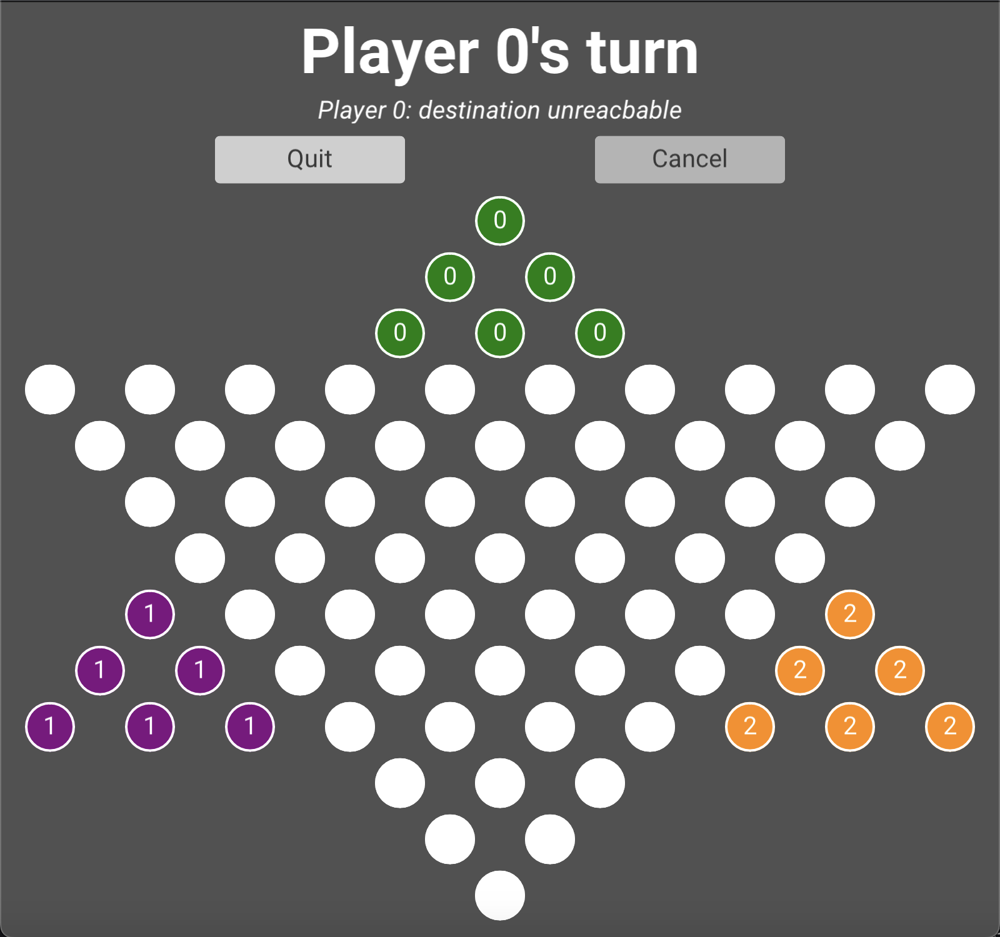

# Prototype of Chinese Checkers

<div align="center">
    
</div>


A prototype of Haskell Chinese Checkers game with multiple players allowed as well as embedded Monte-Carlo Tree Search algorithm. This user guide is structured in three parts: installation, the launch of the application, and the executable files.  

All the executable files provided here are generated from a MacOS environment, therefore, if you are a user of a different platform, you may want to build up the environment first such that application could be run. 

Please make sure that you've already installed sufficient Haskell environments such as GHC (8.10.7), Cabal (3.6.2.0) and Stack (2.9.1), if not, then you might want to have a look at how to [install](https://www.haskell.org/ghcup/) them easily. Besides, it is also required for the user to install certain libraries to ensure the executable file provided can run correctly.

## Installation

To install the application, the folder needs to be cloned from the git or downloaded from the zip file from the submission.

```bash
git clone git@projects.cs.nott.ac.uk:scyty3/msc-project.git <your-app-name>
```

After you clone the project or extract the file, you will see an executable named "app", which is the main body of the application and can be launched through the below command.

```bash
./app
```

To be noticed, you must install additional packages so that the executable can be run based on the necessary libraries, so please look at the [installation](https://github.com/fjvallarino/monomer/blob/main/docs/tutorials/00-setup.md). For Mac users, the following commands are required to install the `sdl2` and `glew`.

```bash
brew install sdl2
brew install glew
```

The installation is done through [Homebrew](https://brew.sh), in case you haven't installed it.

Besides, package `pkg-config` is also needed if not yet installed.

```bash
brew install pkg-config
```

After that, the executable file should be able to run directly on Mac. And if you're interested in how to set up the environment, you can go to the next section, where the complete instruction for the application is described. 

### Stack Environment

Since the application introduces a third-party library for displaying the graphical interface, if you want to make a change to the program and test it, you will need to set up a stack environment.

To build up the environment, navigate to the folder called "first-semester" and run the following command.

```bash
stack build
```

It will construct the necessary libraries used in this program and set up an environment under this folder, mainly for setting the environment for the GUI library called "Monomer". Here is the link to the GitHub of the [monomer](https://github.com/fjvallarino/monomer) and the link to its [installation](https://github.com/fjvallarino/monomer/blob/main/docs/tutorials/00-setup.md), in case you'd like to set up such an environment individually. Notice that, you might be required to install additional packages based on your operating system, so please have a look at the [installation instructions](https://github.com/fjvallarino/monomer/blob/main/docs/tutorials/00-setup.md). This might take around 10 minutes to fully install all libraries and packages after you enter the command. 

If no error appears after the build command, you can then run `stack run Main`, then the application will successfully execute. Initially, it's the same as the app executable, but can be recompiled if you modify the code. Run `stack run Main` every time you make a change to the code, and the program will recompile and generate a new executable based on that. Normally, a path to the produced executable would be provided in the hidden folder ".stack-work".

### Cabal Environment

If you want to access certain hs scripts and run the function individually, you might need to install the applied packages in that script. There are several packages applied in this project:

* `random`
  - `mtl`
  - `extra`
  - `parallel`
  - `containers`
  - `time`

They could be set up through the command `cabal install`, for instance, to add the package 'random', the following command should be entered under folder "first-semester/src".

```bash
cabal install random
```

Once you have set up all the packages listed above, you can access any hs script in the "src" folder except for "Main.hs" which is mainly run under the stack's environment. 

## Launch the application

Once you enter the application, you will see a menu page listing the option of available players allowed in the game. The first row of radios displays the option of total players of a range of $[2, 3, 4, 6]$The second row displays the available computer players, which are restricted to less than the total number of players.   

<div align="center">
    
    
</div>

After the players are settled, pressing the "Start Game" button will enter the game, a corresponding board will be generated. For different players, there are ways to distinguish between them. Each player's pieces are numbered with the same index and in the same colour. To simplify the game, there will be a hint text shown above to remind the player of the certain index to action as well as the winner of the game.

<div align="center">
    
    
    
</div>

Besides, if the user allows computer players to be involved, the hint text will explicitly show which player is AI.
<div align="center">
    
</div>


To move, a player needs to first click one's piece and then click a free space as the destination of the movement. 
<div align="center">
    
</div>
Once the player first clicks a valid position, the resulting available list of destinations will be marked in the corresponding colour as shown above. If an entering movement is invalid, then there will be an error message posted, and the player will need to re-enter another movement. The invalid situations include double-clicking a position, taking a free space at the start of the movement, trying to reach a destination that is too far, or the destination is already occupied by another player. 

<div align="center">
    
    
  	<br>
    
    
</div>

Once the game is finished, the user can close the game or continue the next one with a different setting. Press the "Quit" button, and the page will be returned to the menu, where the user could make a different configuration. 

In addition, the application also provides the functionality of movement cancel, which allows users to cancel one's last move. However, this is only available when a player just finishes one's movement, in other words, it can only reverse to the last board state. Furthermore, this function is not allowed when the computer player is involved, avoiding an unfair situation. 

## Launch the (experimental) executables

> You can skip this if you are not interested in the experiment sets for this prototype.

Besides the "app", there is also a folder "first-semester/src/executables" containing other executable files:

* buildTree
* experiment0
* experiment1
* experiment1_2
* experiment2

These files can be run in the same way as "app" but might require additional arguments while Windows users would need to set up the cabal environment to run these.  

To generate the executable that fits your operating system, please ensure that you have set up the Cabal environment. 

### buildTree

> This executable can be generated from script Configuration.hs

This executable is used for generating the entities for the lookup table. Since there are total $27,228$ entities, it's not possible to finish all computations in a short time, therefore, the executable allows the user to split the entities into several subsections and compute them in parallel.

Run the executable, which requires 3 arguments:

* how many subsections do you want to split into: $n$
* the index of the generated subsection: $[0, n-1]$
* the width used for the heuristic algorithm: $(w_1,w_2)$

For instance,

```bash
./buildTree 16 0 (800,200)
```

The above command declares that the total entities of $27,228$ are roughly divided into $16$ groups: $[s_0, s_1, ...s_{15}]$, and the computation will be made on the first group ($s_0$). $(800,200)$ are the parameters used by the shortest path search algorithm that processes a breadth-first search to find the minimum moves of a board configuration to reach the win state, $800$ is the generation size for searching the opening of the game while $200$ is for the ending.   

Normally, this will take a lot of time to compute all $16$ subsections, even though several programs can be run separately at the same time. The collected data will be stored in a txt file "first-semester/src/dataset/lookup_table_0.txt" based on the given index, in this case, it is $0$. 

Besides, a complete txt file with all entities is provided in the folder "first-semester/src/dataset". 

To compile the executable file, run the below command under folder "first-semester/src", might need to uncomment the "main" function in advance.

```bash
ghc -main-is Configuration Configuration.hs -O2 -outputdir dist -o executables/buildTree
```

After that, you will get the desired executable in the file called "executables".

### experiment0

> The following executables can be generated from script Experiment.hs, to compile the executable, you might need to uncomment the corresponding "main" function

"experiment0", as its name, is not exactly counted as an experiment, it is just a simple test for the MCTS algorithm to reflect its effectiveness. The MCTS applied is constrained by how many iterations it can process, and in this experiment, the user can control the number of iterations $N$ and the constant for the selection strategy $(C, W)$. 

For instance, 

```bash
./experiment0 500 (3,5)
```

The above command will assign $500$ iterations to the search and a pair of parameters $(3,5)$ to the formula used for defining the optimal choice. The experiment will run four trials with players in the range of $[2, 3, 4, 6]$, and stores the turns played by the game simulations in a txt file "first-semester/src/experiment0/experiment.txt". 

### experiment1 & experiment1_2

The experiment is divided into two parts here, it runs based on a similar pattern as the previous one but rather than just a single trial, it allows the user to define how many trials a certain parameter pair should run with default iterations. The experiment tests the performance of the algorithm by trying different combinations of parameters, $C$ and $W$, while the first part only tests the integer combination and the second allows double values. 

For the first part of the experiment, the range is set from 0 to 5 for both parameters, such that there is a total of $36$ pairs of integral values. On the other hand, the second section provides 10 pairs that given a known $C$ combining it with a list of $Ws$: $[0.1, 0.2, ...1.0]$ .

For instance, the below commands run the simulations on a three-player board. 

```bash
./experiment1 3 500
./experiment1_2 3 4 500
```

For "experiment1", for every $36$ parameter pairs, there are 500 trials to run with. For "experiment1_2", given a known $C=4$, such that there are a total of $40$ combination, and for each combination, there are 500 trials to run with. The collected data is the convergence of the search, that is, how fast it eventually turns to find the most "promising path" of the game and will be stored in "first-semester/src/experiment1/experiment_3.txt" and "first-semester/src/experiment1/experiment_3_4.txt" based on the examples. 

### experiment2

The final experiment holds a match between an MCTS player and a random player on a three-player board. The experiment collects the wins achieved by the MCTS player and the turns taken by a game, combining these, the win rate of a parameter pair and how fast it takes on average to end the game become clear to evaluate the performance. 

For instance, to run the experiment with the combined pairs of a given $C = 3$ and a list of $W$ from $[0.1, 0.2, ..., 1.0]$, while each pair is run with $500$ games and default iterations for the search, the corresponding command should be as follows.

```bash
./experiment2 3 500
```

The collected data will then be stored in the file "first-semester/src/experiments/experiment2/experiment2_3.txt".


