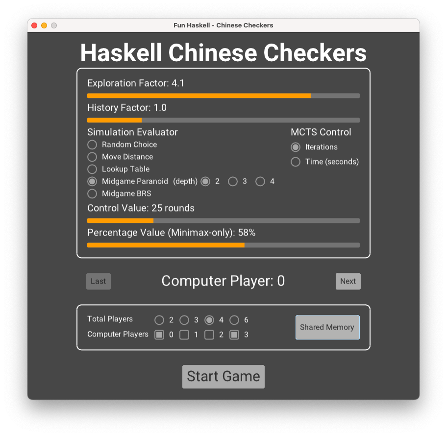

# Haskell Chinese Checkers Platform

> A platform of Chinese Checkers game with multiple players allowed as well as embedded Monte-Carlo Tree Search algorithm.

This markdown sheet is a user guide for those who want to access the platform, the remainder will be divided into three parts: installation and the first launch of the executable, the experimental section, as well as some detailed look at the framework design, including the GUI section and the code implementation. 

<div align="center">
    
</div>
All the sample files provided in this repository are generated based on the stack and cabal environment of macOS, therefore, if you are a user of a different computer system, you may want to build up the corresponding environment first such that application could be generated and run. 

Please make sure that you've already installed sufficient Haskell environments: 

* GHC (8.10.7)
* Cabal (3.6.2.0)
* Stack (2.9.3)

If not, then you might want to have a look at how to [install](https://www.haskell.org/ghcup/) them easily through **GHCup**. Besides, it is also required for the user to install certain libraries to ensure the executable file provided can run correctly, which will also be mentioned in the coming sections. 

The following instructions will be described based on the macOS environment by default, but will also provide some information on other platforms. 


### Monomer starter application

Before we move on, it is significant to let you know that the GUI part of this platform makes use of a Haskell graphical library called "Monomer". More specifically, the interface is structured based on the given sample script of the starter application, including:

- Dependencies
- Model and events type
- Event handler
- UI builder

For more information, please check [here](https://github.com/fjvallarino/monomer) and [here](https://github.com/fjvallarino/monomer-starter).


## Installation

To install the application, the folder needs to be cloned from the repository or downloaded from the zip file from the submission.

```bash
git clone git@projects.cs.nott.ac.uk:scyty3/msc-project.git <your-app-name>
```

After you clone the project or extract the file, open the terminal, either bash or zsh and navigate to the folder *second-semester*:

```bash
cd ./msc-project/second-semester/
```

Then you will see an executable named *app* through browsing the files in the folder. The executable *app* was copied manually from the default generation address of the stack and can be launched through the below command:

```bash
./app
```

To be noticed that before launching the executable, you must install additional packages so that the GUI can be run. Please look at the [installation](https://github.com/fjvallarino/monomer/blob/main/docs/tutorials/00-setup.md) for those required packages. 

For Mac users, the following commands are required to install the `sdl2` and `glew`. 

```bash
brew install sdl2
brew install glew
```

Such installation is done through [Homebrew](https://brew.sh), in case you haven't installed it, it is a popular package manager for macOS and Linux. To install Homebrew, you may need to enter the following command:

```bash
/bin/bash -c "$(curl -fsSL https://raw.githubusercontent.com/Homebrew/install/HEAD/install.sh)"
```

Besides, after the Homebrew is successfully installed, package `pkg-config` is necessary to be installed next:

```bash
brew install pkg-config
```

After all, these are done, you can now try to install packages `sdl2` and `glew` through the above-given commands. And then, the executable file should be able to run directly on Mac. 

Moreover, if you're interested in how to set up the environment (stack and cabal), you can have a look at the next two sections, where the instructions are provided for maintaining such an environment allowing users to make changes to the code. Otherwise, you can skip to the next part which teaches the user how to make use of the platform visually.  


### Stack Environment

Since the application introduces a third-party library for displaying the graphical interface, if you want to make a change to the *Main.hs* and test it, you will need to set up a stack environment.

To build up the environment, navigate to the folder called "second-semester" and run the `stack build` command.

```bash
cd ./msc-project/second-semester/
stack build
```

This command will construct the necessary libraries based on the specifications from *package.yaml* and set up an environment under this folder, mainly for setting the dependencies for the Monomer library. 

Here is the link to the detailed [installation](https://github.com/fjvallarino/monomer/blob/main/docs/tutorials/00-setup.md), which also includes other platforms' instructions, in case you'd like to set up such an environment yourself. 

Notice that, you might be required to install additional packages based on your operating system as mentioned above, so please have a look at the provided link. To load all necessary libraries, it might take around 10 minutes to fully install all libraries and packages after the `stack build` command. You will be able to see the number of downloaded packages and their progress.   

If no error appears, you can then run `stack run Main`, then the application should be successfully executed. Initially, it's the same as the given *app* executable but can be recompiled if you modify the code later on.

Run the `stack build` command every time you make a change to the code, and the program will recompile and generate a new executable based on that. After that, run `stack run Main` and the new executable will be run. 

Normally, a path to the produced executable would be provided in the hidden folder *.stack-work*. Depending on your operating system, the full path should be something like "*.stack-work/install/.../bin/app*".	


### Cabal Environment

If you are not satisfied with accessing just the graphical interface section *Main.hs* and want to access other component scripts such as the *GameTree.hs*, *MCTS.hs*, *Minimax.hs* that deal with the algorithm part. Or you might want to execute a specific function of a script individually by `ghci`, you then will need to install all the imported packages applied in this project. 

The following are the imported packages applied in the project other than the *Main.hs*:

* `random`
* `mtl`
* `extra`
* `parallel`
* `containers`
* `time`
* `async`

They could be set up through the command `cabal install`, for instance, to add the package `random`, first navigate to the *src* folder under the *second-semester*, then run the `install` command:

```bash
cd ./msc-project/second-semester/src
cabal install random
```

Once you have set up all the packages listed above, you can access any *.hs* script in the *src* folder except for *Main.hs* which is mainly run on the environment built by the `stack`. For instance, you can now access the *MCTS.hs* and play around with the functions included:

```bash
ghci MCTS.hs
```


### Directory

Before we go further, here the significant contents of the folder *second-semester* will be described to you such that you could understand their functionalities and what they are used for.

The following tree structure demonstrates the files that are worth mentioning to the user. 

 ```bash
 second-semester
     ├── app
     ├── dataset
     |   └── lookup_table.txt
     └── src
         ├── BFS.hs
         ├── Board.hs
         ├── Configuration.hs
         ├── Experiment.hs
         ├── Extension.hs
         ├── GameTree.hs
         ├── MCTS.hs
         ├── Main.hs
         ├── Minimax.hs
         ├── RBTree.hs
         ├── Zobrist.hs
         ├── experiments0
         ├── experiments1
         └── experiments2
 ```

First of all, the *app* executable is the one that starts the application. The following *dataset* folder stores the lookup table used in this project, which is a Txt file that contains several board configurations and the corresponding scores and both of them require specific functions to unscramble, which leads to the Haskell scripts in the folder of *src*.

In the *src* folder, there is a list of *.hs* scripts as well as some folders storing the experiment results. The folders: *experiments* with suffixes from $0$ to $2$ contain several lists of winners collected from the experimental trials generated from the *Experiment.hs*. 

*Main.hs*, as mentioned, it contains the components for rendering the graphical interface, and the specific components will be described in the coming section. 

The *BFS.hs*, and *Configuration.hs* scripts calculate the entities' contents of the lookup table, the one stored in the *dataset* folder, and *RBTree.hs* and *Configuration.hs* together construct the container's shape and store it in the memory when the program is running. 

Scripts *Board.hs* and *Zobrist.hs* define how the board of Chinese Checkers is computed, either explicitly or implicitly. 

Finally, for processing the MCTS framework, the *GameTree.hs*, *MCTS.hs* and *Minimax. hs* scripts are taken place to give a form of searching appropriate move based on the given board state. 


## Launch the application

Once you enter the application, you will see a menu page listing all options of available players allowed in the game. There are two panels displayed on the screen: one for MCTS configurations and another one for setting the players' (human and computer) numbers. 

<div align="center">
    
</div>


### Menu Page

<div align="center">
    
</div>


In the first panel, the user could set the configurations of the MCTS framework including 

* the parameters of the selection phase's policy
* the choice and the detailed settings of the playout phase's evaluator
* the termination condition of the MCTS

Other than that, for each computer player, there is an identical panel for setting the corresponding configurations. To switch the panel that is associated with a player, the below "Last" and "Next" buttons will help to index to the right panel. 

To be noticed that only the panel corresponding to a computer player could be manipulated, for instance, according to the above sample, only the panels with indices $0$ and $3$ could be adjusted with the widgets, and the other panels will not allow the user to modify unless such a computer player is enabled through the below checkboxes.

On the first panel, there is a number of widgets, which corresponds to a feature of the search algorithm:


* Exploration factor $C$: the larger the value is chosen, the more exploration of unvisited nodes (expanded branches of the search tree) will be investigated, otherwise, the decision will tend toward the exploitation of the well-performed nodes more

  

* History factor $W$: the larger the value is chosen, the longer the influence of the past game history will be made on the decision

  

* Simulation evaluator: this controls the mechanism used to choose the appropriate move throughout the self-play simulation during the MCTS playout phase, you can see this as a strategy for emulating a game
  
  
  
  * Random choice: 
    
    
    
    * Uniformly choosing the moves available but with some priorities for the advancing moves.
    
      
    
  * Move distance: 
    
    
    
    * Picking up the move that gives the largest distance increment, and if there exist multiple moves with maximum distance increments, then randomly choose one of them.
    
      
    
  * Lookup table: 
    
    
    
    * Deciding the optimal move based on the stored board values of the resulting board states, such a board value can be found in the lookup table.
    
      
    
    * During the midgame, the evaluation of distance increment will be considered instead. 
    
      
    
    * Similarly, the ones with the largest value are decided randomly with uniform possibility. 
    
      
    
  * Midgame-only Paranoid/BRS: 
    
    
    
    * The moves during the playout phase are no longer simply decided based on certain heuristics or datasets but on an embedded multi-player version of minimax search. 
    
      
    
    * There are two more options to adjust the settings of such an embedded search: first, the search depth from $2$ to $4$; second, the percentage value for calling the embedded search, which allows the user to modify the frequency of triggering the minimax search per move during the playout.
    
      
  
* MCTS control: the basic workflow of MCTS consists of selection, expansion, playout and backpropagation, and a full run-through of the four phases is called an iteration. 
  
  
  
  * The progress of the search could be defined in two ways, first the number of iterations being completed, and second, the time that restricts a certain number of iterations from completing. 
  
    
  
  * Both restrictions on the same range from $1$ to $100$, either in rounds or seconds. 


<div align="center">
    
</div>


In the second panel, the first row of radios displays the option of total players of a range of $[2, 3, 4, 6]$ and the second row displays the available computer players, which are strictly restricted to less than the total number of players. To trigger a computer player among all available players, ticking the checkboxes below will turn the player with the associated index into a computer player such that the user could manipulate its configuration panel. 

Besides, there provides an additional feature called "Shared Memory", which makes a difference in the game's history. As mentioned before, the choice of MCTS algorithm could be affected based on the game history ($W$), but normally the players will only be affected by the history maintained by themselves. But here, the "Shared Memory" allows all the maintained history to be integrated into one public record, allowing all players to access this and contribute their updates to it. 

### Game Page

After the players are settled, pressing the "Start Game" button will enter the game, a corresponding board will be generated. For different players, there are ways to distinguish between them. Each player's pieces are numbered with the same index and in the same colour. For instance, in a two-player game, the players will be indexed with ids: $0$ and $1$ and with colours green and red; in a three-player game, the players will be indexed with ids: $0$, $1$ and $2$ with colours green, red and orange; and so on.

<div align="center">
    
    
  	<br>
    
    
</div>


To simplify the game, there will be a hint text shown above to remind the player of the certain index to action as well as the winner of the game. Besides, if the user allows computer players to be involved, the hint text will explicitly show which player is AI.

<div align="center">
    
</div>

To move during the game, a player needs to first click one's piece and then click a free space as the destination of the movement. 
<div align="center">
    
</div>

Once the player first clicks a valid position, the resulting available list of destinations will be marked in the corresponding colour as shown above. If an entering movement is invalid, then there will be an error message posted, and the player will need to re-enter another movement. The invalid situations include (1) double-clicking a position, (2) taking a free space at the start of the movement, (3) trying to reach a destination that is too far, or (4) the destination is already occupied by another player. 

<div align="center">
    
    
  	<br>
    
    
</div>

Once the game is finished, the user can close the game or continue the next one with a different setting. Press the `End Game` button, and the page will be returned to the menu, where the user could make a different configuration. 

<div align="center">
    
</div>

In addition, there exists a thread handler for managing the threads being expanded during the game. Since the computer players are allowed to compete with the other players, the equipped search algorithm was designed to be triggered on an individual thread called "*Task*" in Monomer, therefore, the cash of the IO action won't affect the main thread's application. Considering that the user might terminate the game while the search algorithm is still figuring out which move should be taken, it's significant to kill that activated thread such that the program won't be stalling due to many working threads. 

```bash
Error processing Widget task result: thread killed
```

If such a situation happens, the above error message will appear showing that there is a thread being terminated while it is working. 

Meanwhile, there is also a final clean when the close icon is clicked by the user when wanting to leave the application, the following message will be posted to tell the user if all generated threads are cleaned.

```bash
All remaining threads were cleaned
```

Otherwise, it will say:

```bash
Unable to clean all generated threads
```

This could be due to too many times restarting a game or some exceptions has occurred. 


## Launch the (experimental) executables

> You can skip this if you are not interested in the experiment sets for the playout evaluators

Besides the *app*, there are also a series of executable files:

* speedTest
* experiment0
* experiment1
* experiment2

These files can be run in the same way as *app* but require additional arguments while Windows users would need to set up the cabal environment to run these. 

The results generated from the executables will be sent to specific folders named *experiments0*, *experiments1*, and *experiments2*. Such folders were already set up in the project, but if you want to executable the experimental trials in a different location, please make sure that such folders are set up as well. 

To generate the executable that fits your operating system, please ensure that you have set up the correct cabal environment. 

Also, the following executables can be generated from script *Experiment.hs*, to compile the executable, you might need to uncomment the corresponding `main` function. 


### speedTest

"speedTest", as its name, is not exactly counted as an experiment, it is just a simple test for the playout phase's evaluator to reflect its efficiency. The evaluators being tested here are constrained by how many simulations they can process as well as the limited time. In this experiment, the user can control the limited time $T$ to see how long it will cost to reach a set number of simulations $N$. 

For instance,

```bash
./speedTest 10 "(MParanoid, 2, 100)"
```

The above command executes the test with a playout evaluator of midgame-only Paranoid minimax search, the search depth is set to 2 and the frequency of calling such a search is 100%, which means, always. The test will run the playout with such an evaluator 10 times while recording the time, the returned outcome will be printed as below, demonstrating the spent time to complete $N$ simulations. 

```bash
(MParanoid,2,10)'s time cost: 0.216351s
```

To be noticed that only the embedded search is allowed to set the search depth and frequency, other evaluators such as move-based, board-based and random-based will be formed as `(Move,0,0)`, `(Board,0,0)` and `(Random,0,0)`. 


To compile the executable file, navigate to the folder "*second-semester/src*", and then open the "Experiment.hs" script. 

You might need to uncomment the corresponding `main` function first in the script:

```haskell
main = do arg <- lookupTable `seq` getArgs
          let input = read $ head arg
              player = read $ arg !! 1
          result <- runMultipleSimulations input (0.1, 5) player
          putStrLn $ show player ++ "'s time cost: " ++ show result ++ "s"
```

You can make changes to the input parameters, here, the default is $(0.1,5)$. After that, run the compile command on the terminal:

```bash
ghc -main-is Experiment Experiment.hs -O2 -threaded -outputdir dist -o speedTest
```

And you will get the desired executable that runs the speed test.


### experiment0

"experiment0", as its name, is not exactly counted as an experiment, it is just a simple test for tuning the parameter pair for the MCTS selection phase $(C, W)$ with the playout phase's evaluator. The evaluators being tested here are constrained by how many simulations they can process $N$. 

In this experiment, the user can control the playout evaluator $E$ as well as the parameters for the selection phase: $(C, W)$. The resulting algorithm will be placed on a player competing with another player (Random-based by default) with the same setting but different evaluator several times ($20$ times by default). And the resulting win rates will be collected and stored in a folder called *experiments0*.

The corresponding `main` function in the script is shown below:

```haskell
main = do arg <- lookupTable `seq` getArgs
          let p  = read $ head arg :: PlayoutArgument
              ws = read $ arg !! 1 :: [Double]
              cs = [0.1, 0.2, 0.3, 0.4, 0.5]
          mapM (testConstantPair p cs) ws
```

In which way, the inputted $W$ is combined with a list of candidates $C$ from $0.1$ to $0.5$. 

A sample command will be like this:

```bash
./experiment0 "(Move, 0, 0)" 5
```

Where the evaluator being tested against the default evaluator is move-based and the entered history factor is $5$, meaning that there will be five sets: $[(0.1, 5), (0.2,5), (0.3,5), (0.4,5),(0.5,5)]$ and each will be run $20$ times between two players of evaluators. A rough performance of this list of parameters could be evaluated based on the achieved win rates. 

Again, this could be modified to achieve the test form you want, but please remember to recompile after any modification is made as well as make sure that a folder *experiments0* is generated. 

```bash
ghc -main-is Experiment Experiment.hs -O2 -threaded -outputdir dist -o experiment0
```


### experiment1 & experiment2

The experiment is divided into two parts here, it runs based on a similar pattern as the previous one but rather than just matches between fixed players, it allows different assignments of players with evaluators to be competed together.

```haskell
main = do arg <- lookupTable `seq` getArgs
          let input = read $ head arg :: Double
              player1 = read $ arg !! 1 :: PlayoutArgument
              player2 = read $ arg !! 2 :: PlayoutArgument
              trials = read $ arg !! 3 :: Int
          autoRunExperiment trials (0.1, 5) input (player1, player2)
          putStrLn "All Completed!"
          return ()
```

In the first set of experiments, pairs of players are designed to be competing with each other several times, and the resulting win rates will be stored in folder *experiments1*. According to the `main` function here, two players of evaluator, `player1` and `player2`, will be matched for the times of `trials` while each MCTS search is restricted within a thinking time of `input`. Here, the competition will be formed as a three-player game with two players sharing the same evaluator. 

```bash
./experiment1 0.25 "(Move,0,0)" "(Board,0,0)" 167
```

The above command will run $167$ competitions between each assignment of the two evaluators: move-based and board-based, with a fixed thinking time of $0.25s$. And since there are a total of six assignments of two players in a three-player game, therefore, the total count will be $167 \times 6 = 1002$. 


The second set of experiments also runs a series of matches but allows involve players of three to be tested at the same time. 

```haskell
main = do arg <- lookupTable `seq` getArgs
          let input = read $ head arg :: Double
              player1 = read $ arg !! 1 :: PlayoutArgument
              trials = read $ arg !! 2 :: Int
              invovledPlayers = [(Move,0,0), (Random,0,0), player1]
          autoRunExperiment2 trials (0.1, 5) input invovledPlayers
          putStrLn "All Completed!"
          return ()
```

The `main` function might need to be modified as above form, and recompile to produce the correct executable. According to the above function, it will take the length of the thinking time, an evaluator, and the number of trials. The competition will be formed as a three-player game with all players owning different evaluators. 

```bash
./experiment2 0.25 "(Board,0,0)" 167
```

Similarly, the above command will execute $167$ experimental trials of games between three players of evaluators: move-based, random-based and board-based, and the total count will again be $1002$ since the assignments are also six. And the results will be stored in the folder *experiments2*.


### Read win rates

To retrieve the resulting win rates from a list of winners, here provide an analysis function that calculates the win rate for you:

```haskell
winRate :: PlayoutArgument -> [PlayoutArgument] -> Double
winRate x xs = fromIntegral (length (x `elemIndices` xs)) / fromIntegral (length xs)

loadExperimentData :: Read b => FilePath -> IO [b]
loadExperimentData fileName = do filePath <- openFile fileName ReadMode
                                 contents <- hGetContents filePath
                                 return $ read contents
```

The `loadExperimentData` function is given in script *Experiment.hs* which takes a file path and provides a list of winners read from the file. After that, call the `winRate` function, and the average occurs will be given, equivalent to the win rate here. 

For instance, first enter ghci under *src* and then execute the function with the desried record:

```bash
cd src
ghci Experiment.hs
*Experiment> winners <- loadExperimentData "./experiments2/[(Move,0,0),(Board,0,0),(Random,0,0)]_0.25.txt" :: IO [PlayoutArgument]
*Experiment> winRate (Move,0,0) winners
0.3652694610778443
```


